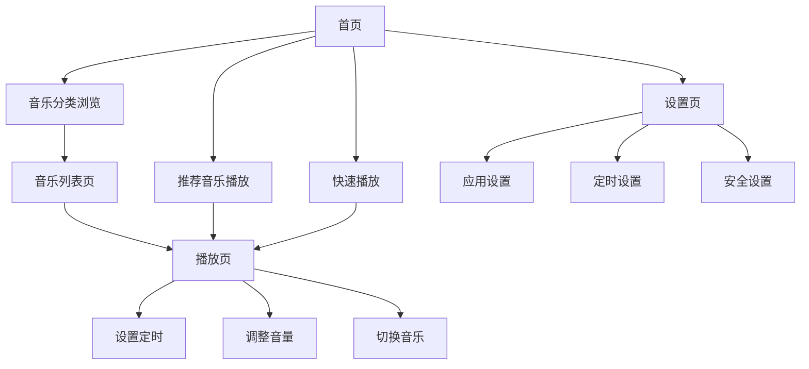

# 婴幼儿音乐APP需求文档

## 1. 产品概览

**产品名称：** 希希的音乐播放器

**产品定位：** 专为0-6岁婴幼儿设计的音乐播放应用，提供简单、安全、适合婴幼儿的音乐体验。

**核心价值：**
- 为婴幼儿提供优质、适合年龄的音乐内容
- 简洁易用的界面，适合家长操作
- 安全无广告，保护婴幼儿身心健康
- 辅助婴幼儿睡眠和情绪安抚
- 支持内置音乐和外部导入，满足多样化需求

## 2. 核心功能

### 2.1 用户角色

| 角色 | 注册方式 | 核心权限 |
|------|----------|----------|
| 家长用户 | 无需注册 | 可使用所有功能，包括播放控制、音乐管理、设置等 |

### 2.2 功能模块

我们的婴幼儿音乐APP包含以下核心页面：
1. **首页**：音乐分类展示、推荐音乐、快速播放
2. **播放页**：音乐播放控制、定时设置、视觉效果
3. **音乐列表页**：音乐分类浏览、收藏管理、内置音乐、外部导入
4. **设置页**：应用设置、定时设置、安全设置

### 2.3 页面详情

| 页面名称 | 模块名称 | 功能描述 |
|----------|----------|----------|
| 首页 | 音乐分类 | 展示不同类型的婴幼儿音乐，如摇篮曲、儿歌、自然声音等，支持点击进入分类列表 |
| 首页 | 推荐音乐 | 展示系统推荐的热门或适合当前时间的音乐，支持一键播放 |
| 首页 | 快速播放 | 提供常用音乐的快速播放按钮，如睡眠音乐、安抚音乐等 |
| 播放页 | 播放控制 | 提供大尺寸的播放/暂停、上一曲、下一曲按钮，支持滑动调节音量 |
| 播放页 | 定时设置 | 提供15分钟、30分钟、60分钟等定时选项，到时间自动停止播放 |
| 播放页 | 视觉效果 | 播放音乐时显示柔和的动画效果，如彩色气泡、星星闪烁等，吸引婴幼儿注意力 |
| 音乐列表页 | 分类浏览 | 按分类展示所有音乐，支持滑动浏览和点击播放 |
| 音乐列表页 | 收藏管理 | 支持将喜欢的音乐添加到收藏列表，方便快速访问 |
| 音乐列表页 | 内置音乐 | 展示应用内置的数十首婴幼儿音乐，按分类组织，支持直接播放 |
| 音乐列表页 | 外部导入 | 支持从设备本地存储导入音乐文件，自动识别并添加到音乐列表 |
| 设置页 | 应用设置 | 提供音量默认值、启动页设置、后台播放设置等 |
| 设置页 | 定时设置 | 提供定时播放和定时停止的详细设置 |
| 设置页 | 安全设置 | 提供防误触模式，防止婴幼儿误操作手机 |

## 3. 核心流程

### 主要用户操作流程

**家长用户使用流程：**
1. 打开应用，进入首页
2. 选择音乐分类或推荐音乐
3. 点击播放按钮开始播放音乐
4. 在播放页调整音量、设置定时
5. 可返回首页选择其他音乐，或进入设置页进行个性化设置

**防误触模式使用流程：**
1. 在设置页开启防误触模式
2. 应用进入防误触状态，屏幕边缘区域不可点击
3. 需要输入预设手势或密码才能退出防误触模式



## 4. 用户界面设计

### 4.1 设计风格

**整体风格：** 简洁、明快、温馨，适合婴幼儿审美

**色彩方案：**
- 主色调：柔和的蓝色 (#4A90E2) 和粉色 (#F8BBD0)
- 辅助色：黄色 (#FFD54F)、绿色 (#81C784)
- 背景色：浅色系，如淡蓝 (#E3F2FD)、淡粉 (#FCE4EC)
- 文字色：深色系，确保清晰可读

**视觉元素：**
- 大尺寸按钮，易于点击
- 圆润的界面元素，避免尖锐边角
- 可爱的卡通图标和插图
- 柔和的动画效果，如渐变、淡入淡出

**字体：**
- 主字体：无衬线字体，如Roboto
- 字体大小：标题 20-24px，正文 16-18px，确保清晰可读

### 4.2 页面设计概览

| 页面名称 | 模块名称 | UI元素 |
|----------|----------|--------|
| 首页 | 音乐分类 | 大尺寸卡片式布局，每个分类配有可爱图标，背景为柔和渐变色，卡片间距适中 |
| 首页 | 推荐音乐 | 横向滚动的音乐卡片，显示音乐名称和简短描述，卡片有轻微阴影效果 |
| 首页 | 快速播放 | 圆形大按钮，配有直观的图标，如月亮代表睡眠音乐，太阳代表欢快音乐 |
| 播放页 | 播放控制 | 居中的大尺寸播放/暂停按钮，两侧为上一曲/下一曲按钮，底部为音量调节滑块 |
| 播放页 | 定时设置 | 底部弹出的定时选项，使用大尺寸数字和图标，支持滑动选择 |
| 播放页 | 视觉效果 | 背景为柔和的彩色渐变，随音乐节奏显示简单的动画效果，如彩色气泡漂浮 |
| 音乐列表页 | 分类浏览 | 列表项使用大尺寸字体，左侧显示音乐图标，右侧显示播放按钮，支持滑动删除收藏 |
| 音乐列表页 | 收藏管理 | 收藏按钮为明显的心形图标，收藏状态有动画反馈 |
| 设置页 | 应用设置 | 列表式布局，每个设置项配有图标，开关使用大尺寸滑块 |
| 设置页 | 定时设置 | 类似播放页的定时设置界面，提供更详细的时间选择 |
| 设置页 | 安全设置 | 大尺寸的防误触模式开关，配有详细的文字说明 |

### 4.3 响应式设计

**设计目标：** 适配不同尺寸的Android设备，确保在手机和平板上都有良好的用户体验

**适配策略：**
- 使用ConstraintLayout进行布局，确保元素自适应不同屏幕尺寸
- 关键UI元素（如播放按钮）使用固定尺寸，确保在任何设备上都易于点击
- 文字大小使用sp单位，确保在不同屏幕密度下保持可读性
- 针对平板设备，优化布局，增加元素间距，提供更舒适的视觉体验

## 5. 技术方案

### 5.1 技术栈

**开发语言：** Kotlin

**开发框架：**
- Android SDK
- Jetpack组件（ViewModel、LiveData、Room等）
- Jetpack Compose（UI框架）

**核心库：**
- ExoPlayer（音乐播放）
- Room（本地数据存储）
- Kotlin Coroutines（异步处理）

**存储方案：**
- 本地存储：音乐文件存储在应用内部存储或外部存储
- 数据存储：使用Room数据库存储音乐信息、用户设置等

### 5.2 应用架构

**架构模式：** MVVM（Model-View-ViewModel）

**模块划分：**
- `app`：应用主模块
  - `ui`：界面相关代码，按页面划分
  - `viewmodel`：ViewModel类，处理业务逻辑
  - `model`：数据模型和数据源
  - `repository`：数据访问层
  - `service`：服务类，如音乐播放服务
  - `util`：工具类
  - `constant`：常量定义

**关键类：**
- `MusicPlayerService`：音乐播放服务，处理音乐播放逻辑
- `MusicViewModel`：音乐相关的ViewModel，管理音乐列表和播放状态
- `TimerManager`：定时管理类，处理定时播放和停止
- `SettingsManager`：设置管理类，处理应用设置

### 5.3 数据结构

**音乐文件：**
```kotlin
data class Music(
    val id: Long,
    val title: String,
    val artist: String,
    val duration: Int, // 时长（秒）
    val filePath: String,
    val category: String,
    val isFavorite: Boolean,
    val coverResId: Int // 封面资源ID
)
```

**用户设置：**
```kotlin
data class Settings(
    val id: Long,
    val defaultVolume: Int, // 默认音量（0-100）
    val autoPlay: Boolean, // 自动播放下一首
    val visualEffects: Boolean, // 视觉效果开关
    val antiTouchMode: Boolean, // 防误触模式
    val defaultTimer: Int // 默认定时（分钟）
)
```

### 5.4 关键功能实现

**音乐播放：**
- 使用ExoPlayer实现音乐播放，支持本地文件播放
- 实现后台播放功能，即使应用退到后台也能继续播放
- 支持音频焦点管理，当其他应用需要音频焦点时暂停播放

**内置音乐：**
- 将数十首适合婴幼儿的音乐内置到应用 assets 目录
- 应用首次启动时将内置音乐复制到应用数据目录
- 按分类组织内置音乐，方便用户浏览和选择

**外部导入：**
- 实现文件选择器，支持从设备本地存储选择音乐文件
- 支持批量导入音乐文件
- 自动解析音乐文件的元数据（标题、艺术家、时长等）
- 将导入的音乐添加到音乐列表，并支持分类管理

**定时功能：**
- 使用Handler和Runnable实现定时功能
- 提供多种定时选项，到时间后自动停止播放
- 支持定时设置的持久化存储

**防误触模式：**
- 实现屏幕边缘区域的触摸拦截
- 提供手势或密码解锁机制
- 确保在防误触模式下，关键功能（如停止播放）仍可访问

**视觉效果：**
- 使用Android动画API实现柔和的视觉效果
- 音乐播放时显示与音乐节奏同步的动画
- 提供多种视觉效果主题，如星空、海洋、森林等

## 6. 非功能需求

### 6.1 性能需求

- **启动时间：** 应用启动时间不超过3秒
- **播放流畅度：** 音乐播放无卡顿，切换音乐响应时间不超过1秒
- **内存占用：** 正常运行时内存占用不超过100MB
- **电池消耗：** 后台播放时电池消耗适中，连续播放5小时电池消耗不超过20%

### 6.2 安全需求

- **无广告：** 应用内完全无广告，避免干扰婴幼儿
- **隐私保护：** 不收集任何用户数据，保护用户隐私
- **内容安全：** 所有音乐内容均经过筛选，确保适合婴幼儿
- **防误操作：** 提供防误触模式，防止婴幼儿误操作手机

### 6.3 兼容性需求

- **Android版本：** 支持Android 6.0 (API 23)及以上版本
- **屏幕适配：** 支持各种屏幕尺寸和密度的Android设备
- **设备适配：** 兼容主流Android手机和平板设备

### 6.4 可用性需求

- **界面简洁：** 界面元素简洁明了，操作流程简单直观
- **按钮尺寸：** 关键操作按钮尺寸不小于48dp，确保易于点击
- **响应反馈：** 所有操作都有明确的视觉或听觉反馈
- **错误处理：** 应用崩溃率低于0.1%，出现错误时提供友好的错误提示

## 7. 部署与发布

### 7.1 应用包信息

- **应用名称：** 希希的音乐播放器
- **包名：** com.xixi.musicplayer
- **版本号：** 1.0.0
- **目标SDK：** Android 14 (API 34)
- **最小SDK：** Android 6.0 (API 23)

### 7.2 发布渠道

- **Google Play Store**
- **国内应用商店**：如华为应用市场、小米应用商店、OPPO应用商店、vivo应用商店等

### 7.3 应用权限

| 权限 | 用途 | 是否必须 |
|------|------|----------|
| READ_EXTERNAL_STORAGE | 读取外部存储中的音乐文件，用于导入外部音乐 | 必须 |
| WRITE_EXTERNAL_STORAGE | 写入外部存储，用于缓存音乐文件和导出设置 | 可选 |
| FOREGROUND_SERVICE | 前台服务，用于后台播放音乐 | 必须 |
| VIBRATE | 用于操作反馈 | 可选 |

## 8. 项目规划与迭代

### 8.1 开发阶段

**阶段一：基础功能开发**
- 完成应用框架搭建
- 实现音乐播放核心功能
- 开发首页和播放页
- 实现基本设置功能

**阶段二：功能完善**
- 开发音乐列表页和分类功能
- 实现定时功能
- 开发防误触模式
- 优化用户界面

**阶段三：测试与优化**
- 进行功能测试和兼容性测试
- 优化性能和稳定性
- 完善错误处理
- 准备发布

### 8.2 迭代计划

**版本 1.0.0**：基础版本，包含核心播放功能和基本设置

**版本 1.1.0**：增加音乐分类和收藏功能

**版本 1.2.0**：增加定时功能和防误触模式

**版本 1.3.0**：增加视觉效果和更多音乐内容

**版本 2.0.0**：增加在线音乐功能和用户账户系统

## 9. 风险评估

| 风险 | 影响程度 | 可能性 | 应对措施 |
|------|----------|--------|----------|
| 音乐版权问题 | 高 | 中 | 使用无版权或获得授权的音乐内容，或提供用户自行添加音乐的功能 |
| 应用性能问题 | 中 | 低 | 优化代码结构，减少内存占用，使用高效的音乐播放库 |
| 兼容性问题 | 中 | 中 | 进行充分的设备兼容性测试，适配不同Android版本和设备 |
| 用户体验问题 | 中 | 低 | 进行用户测试，收集反馈，持续优化界面和功能 |
| 安全问题 | 高 | 低 | 确保应用无广告、无恶意代码，保护用户隐私 |

## 10. 结论

本需求文档详细描述了婴幼儿音乐APP的产品定位、核心功能、用户界面设计和技术实现方案。通过本项目的开发，我们将为家长和婴幼儿提供一款简单、安全、优质的音乐播放应用，帮助婴幼儿在音乐中快乐成长。

项目团队应严格按照本需求文档的要求进行开发，确保产品质量和用户体验。同时，应根据实际开发过程中的反馈和市场需求，及时调整和优化产品功能，以满足用户的需求。